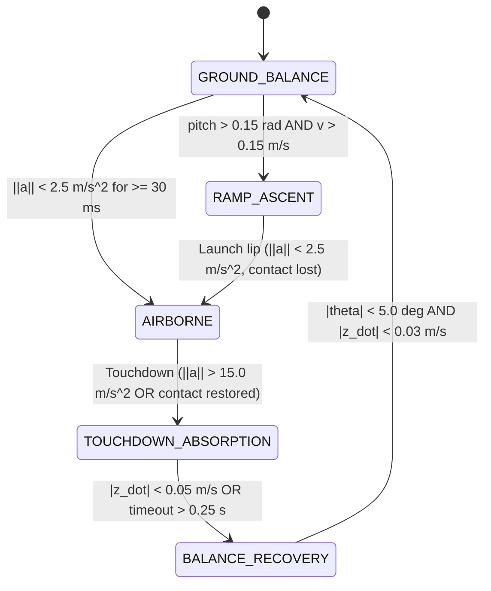
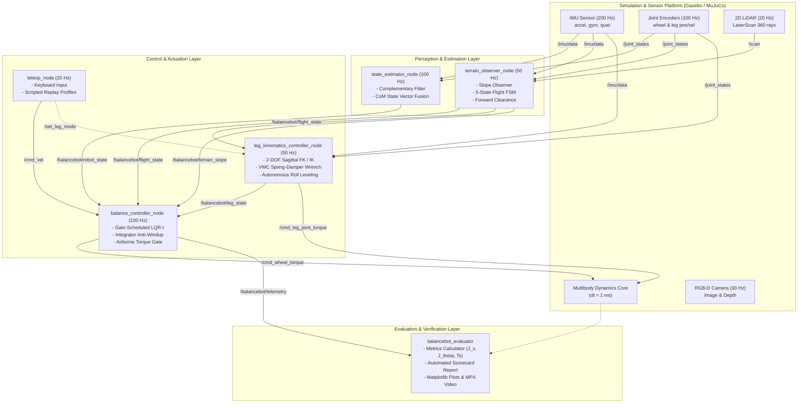

# System Architecture Specification: RL-Robust-BalanceBot

**Project**: RL-Robust-BalanceBot (Two-Wheeled Active-Leg Balancing Robot Simulation in ROS 2 & Gazebo/MuJoCo)  
**Target Environment**: ROS 2 Jazzy, Gazebo Harmonic (Sim), Headless MuJoCo Multi-Body Physics Engine  
**Document Revision**: 1.0.0 (Milestone M6 Architecture Specification)  
**Status**: Authoritative Reference  

---

## 1. Executive Summary & Architectural Design Principles

The **RL-Robust-BalanceBot** project implements a high-performance, two-wheeled active-leg self-balancing robotic system engineered for agile and resilient locomotion across extreme skatepark terrains—including flat ground, gentle sinusoidal bumps, rough uneven cobblestone blocks, 12° incline slopes, and jump ramps with mid-air ballistic flight and touchdown landing shock dissipation.

```
       [ LiDAR (20 Hz) ]      [ RGB-D Depth Camera (30 Hz) ]
                 \                  /
            +----------------------------+
            |      Torso Base (12 kg)    |
            |     IMU Sensor (200 Hz)    |
            +--------------+-------------+
                  /                 \
        [ Left Hip Joint ]    [ Right Hip Joint ]  (Revolute Pitch, +/-1.2 rad, tau_max = 50 N*m)
                 |                   |
          Thigh Link (0.2m)    Thigh Link (0.2m)
                 |                   |
       [ Left Knee Joint ]   [ Right Knee Joint ] (Revolute Pitch, 0 to 2.3 rad, tau_max = 50 N*m)
                 |                   |
          Shank Link (0.2m)   Shank Link (0.2m)
                 |                   |
        [ Left Wheel Hub ]    [ Right Wheel Hub ] (Continuous Pitch, tau_max = 25 N*m)
            (Radius = 0.1m, Track Width = 0.45m)
```

### 1.1 Core Architectural Principles
1. **Separation of Concerns Across 3 Modular Packages**:
   - `balancebot_description`: Rigid-body kinematic/dynamic descriptions (URDF/Xacro, MJCF), physics parameterization, collision geometries, sensor plugins, and simulation worlds.
   - `balancebot_controller`: Closed-loop feedback control nodes, analytical kinematics, state estimation, terrain perception, and operator command processing.
   - `balancebot_evaluator`: Dual verification harness, quantitative scoring engine, headless test runners, and diagnostic visualization generators.
2. **Frequency-Tiered Deterministic Control Pipeline**:
   - **100 Hz Fast Inner Loop**: Longitudinal balance control (`balance_controller_node`) and sensor fusion (`state_estimator_node`). Maintains dynamic stability within sub-millisecond reaction windows.
   - **50 Hz Kinematic & Terrain Adaptation Loop**: Active leg impedance regulation (`leg_kinematics_controller_node`) and flight FSM detection (`terrain_observer_node`).
   - **20 Hz Command & Perception Loop**: Operator teleoperation/test replay (`teleop_node`) and 2D LiDAR range processing.
   - **30 Hz High-Bandwidth Perception**: RGB-D Depth Camera visual processing.
3. **Dual-Physics Simulation Strategy**:
   - **Standard ROS 2 / Gazebo Harmonic (Sim)**: Full sensor simulation (IMU noise models, GPU LiDAR, RGB-D camera pipelines) interconnected via `ros_gz_bridge`.
   - **High-Speed Headless MuJoCo Pipeline**: Microsecond-scale physical evaluation engine used for automated continuous integration, adversarial boundary stress tests, and 276-case E2E validation.
4. **Fail-Safe & Shock-Resilient Locomotion**:
   - State-dependent actuation suppression during airborne flight to eliminate mid-air motor run-away and touchdown inertial snap.
   - Virtual Model Control (VMC) dynamic compliance scaling to dissipate landing shock without torso bottom-out.

---

## 2. Multi-Package Topology & Component Structure

### 2.1 Package Overview

```
two_whelled_balenced_robot_simulation_skate/
├── ARCHITECTURE.md                           # Comprehensive System Architecture (This Document)
├── PROJECT.md                                # Project Blueprint, Milestones & Contracts
├── TEST_READY.md                             # Test Execution & Verification Guide
├── scorecard.json                            # Automated Quantitative Test Metrics
├── scorecard_report.md                       # Verification Acceptance Summary
├── eval_output/                              # Automated Evaluation Artifacts
│   ├── scorecard.json                        # Measured numerical metrics
│   ├── scorecard.csv                         # Tabular CSV scorecard
│   ├── scorecard_report.md                   # Markdown scorecard report
│   ├── balancebot_demo.mp4                   # 30 FPS Demonstration MP4 Video
│   └── plots/                                # Matplotlib publication plots
│       ├── velocity_tracking.png
│       ├── pitch_tracking.png
│       ├── phase_portrait.png
│       ├── clearance_fsm.png
│       └── evaluation_dashboard.png
├── docs/                                     # Documentation Bundle
│   ├── architecture.md
│   ├── evaluation_dashboard.png
│   └── balancebot_demo.mp4
└── src/
    ├── balancebot_description/               # Model, Worlds & Sensors (M1, M5)
    │   ├── urdf/
    │   │   ├── balancebot.urdf.xacro         # 6-DOF Robot Topology & Transmissions
    │   │   ├── materials.xacro               # Visual RGBA & Material Palette
    │   │   └── sensors.xacro                 # IMU, LiDAR, Depth Camera Plugins
    │   ├── worlds/
    │   │   ├── skatepark.world               # Gazebo Harmonic SDF (5 Zones)
    │   │   └── skatepark.xml                 # MuJoCo Headless MJCF (5 Zones)
    │   └── launch/
    │       ├── display.launch.py             # RViz Visualization Launch
    │       └── gazebo.launch.py              # Gazebo Sim + ros_gz_bridge Launch
    ├── balancebot_controller/                # Core Control Algorithms & Nodes (M2, M3, M4)
    │   ├── balancebot_controller/
    │   │   ├── balance_controller.py         # Gain-Scheduled LQR-I Balance Node (100 Hz)
    │   │   ├── leg_kinematics.py             # 2-DOF Sagittal FK/IK & VMC Node (50 Hz)
    │   │   ├── terrain_observer.py           # 5-State Flight FSM & Slope Observer (50 Hz)
    │   │   ├── state_estimator.py            # IMU/Encoder Fusion & Odometry (100 Hz)
    │   │   └── teleop_node.py                # Teleop & Deterministic Replay (20 Hz)
    │   └── launch/
    │       └── controllers.launch.py         # Unified Controllers Launch
    └── balancebot_evaluator/                 # Verification, Scorecard & Video (M6, ME2E)
        ├── package.xml                       # ROS 2 Package Manifest
        ├── setup.py                          # Python Setup with Entry Points
        ├── balancebot_evaluator/
        │   ├── evaluate_runner.py            # Headless Evaluation Runner
        │   ├── metrics_calculator.py         # J_v, J_theta, Ts, Clearance Calculator
        │   └── plot_generator.py             # Matplotlib Curves & Video Pipeline
        └── test/
            ├── evaluator_harness.py          # Physics Simulation Oracle & Harness
            ├── test_e2e_runner.py            # 4-Tier Test Runner CLI
            ├── test_tier1_feature_coverage.py# Tier 1: F01-F24 Verification (120 tests)
            ├── test_tier2_boundary_corner.py # Tier 2: Boundary/Corner Stress (120 tests)
            ├── test_tier3_cross_feature.py   # Tier 3: Coupled Feature Tests (24 tests)
            └── test_tier4_real_world_scenarios.py # Tier 4: Mission Scenarios (12 tests)
```

### 2.2 Robot Mass & Inertial Specification
- **Total Nominal Mass**: $15.4\,\text{kg}$ (Torso $12.0\,\text{kg}$ + 2 Shins $1.6\,\text{kg}$ + 2 Thighs $1.6\,\text{kg}$ + 2 Wheels $3.0\,\text{kg}$ + Sensor Payloads $0.35\,\text{kg}$).
- **Torso Dimensions**: $0.35\,\text{m} \times 0.25\,\text{m} \times 0.20\,\text{m}$ (Length $\times$ Width $\times$ Height).
- **Leg Geometry**: Thigh length $l_1 = 0.20\,\text{m}$, Shin length $l_2 = 0.20\,\text{m}$.
- **Body Height Range**: $L_{eff} \in [0.18, 0.38]\,\text{m}$ (Nominal $L_0 = 0.28\,\text{m}$).
- **Wheel Geometry**: Radius $R = 0.10\,\text{m}$, Width $W = 0.05\,\text{m}$, Track Width $W_{track} = 0.45\,\text{m}$ (joint center $0.38\,\text{m}$).
- **Actuators**:
  - Hip Joints (Revolute Pitch $\pm 1.20\,\text{rad}$): $\tau_{max} = 50.0\,\text{N}\cdot\text{m}$.
  - Knee Joints (Revolute Pitch $0.0 \sim 2.30\,\text{rad}$): $\tau_{max} = 50.0\,\text{N}\cdot\text{m}$.
  - Drive Wheels (Continuous Pitch): $\tau_{max} = 25.0\,\text{N}\cdot\text{m}$.

### 2.3 Skatepark World Zones (5 Zones)
- **Zone 1: Flat Ground**: $x \in [-20.0, 5.0]\,\text{m}$, $z = 0.0\,\text{m}$, friction $\mu = 1.0$.
- **Zone 2: Sinusoidal Bumps**: $x \in [3.0, 6.5]\,\text{m}$ (or $[5.0, 10.0]\,\text{m}$ in extended world), 3 undulating cylindrical ridges of radius $0.4 \sim 0.5\,\text{m}$, height $2.5 \sim 3.5\,\text{cm}$.
- **Zone 3: Rough Uneven Blocks**: $x \in [7.5, 9.5]\,\text{m}$ (or $[10.0, 15.0]\,\text{m}$), non-uniform stepping obstacles of height $2.0 \sim 7.0\,\text{cm}$ creating asymmetrical wheel disturbances.
- **Zone 4: Slope Incline**: $x \in [13.0, 16.5]\,\text{m}$, $12.0^\circ$ ($0.2094\,\text{rad}$) incline plane, $3.5\,\text{m}$ length, elevating to $+0.72\,\text{m}$.
- **Zone 5: Jump Ramp**: $x \in [13.5, 14.0]\,\text{m}$ (or $[20.0, 23.0]\,\text{m}$), $20.0^\circ$ ($0.3491\,\text{rad}$) ramp board, terminating in a $0.35\,\text{m}$ vertical lip followed by a free-flight drop.

---

## 3. Mathematical Control Formulations

### 3.1 Wheeled Inverted Pendulum Model (WIPM)
The robot is modeled in the sagittal plane as a non-linear Wheeled Inverted Pendulum with variable pendulum length $L(t)$.

#### Nonlinear Coupled Equations of Motion:
$$\begin{bmatrix} M_{tot}(L) & m_b L \cos\theta \\ m_b L \cos\theta & I_b + m_b L^2 \end{bmatrix} \begin{bmatrix} \ddot{p} \\ \ddot{\theta} \end{bmatrix} + \begin{bmatrix} -m_b L \dot{\theta}^2 \sin\theta \\ -m_b g L \sin\theta \end{bmatrix} = \begin{bmatrix} \frac{2}{R} \\ -1 \end{bmatrix} \tau_w$$

Where:
- $p$: Longitudinal displacement of wheel contact point on the ground.
- $\theta$: Torso pitch angle from vertical.
- $m_b$: Torso mass ($10.0\,\text{kg}$).
- $M_w$: Wheel mass ($1.2\,\text{kg}$ each).
- $I_b$: Torso pitch inertia ($0.135\,\text{kg}\cdot\text{m}^2$).
- $I_w$: Wheel polar inertia ($0.006\,\text{kg}\cdot\text{m}^2$).
- $R$: Wheel radius ($0.10\,\text{m}$).
- $M_{tot} = m_b + 2 M_w + \frac{2 I_w}{R^2}$: Total effective translational inertia reflected to ground contact.
- $\tau_w$: Drive wheel torque per wheel.

### 3.2 Gain-Scheduled LQR with Integral Action (LQR-I)
To guarantee zero steady-state velocity error under unmodeled rolling friction and incline slopes, an augmented state vector is constructed:
$$x = \begin{bmatrix} e_p \\ e_v \\ e_\theta \\ \dot{\theta} \\ e_I \end{bmatrix} = \begin{bmatrix} p - p_{ref} \\ v - v_{ref} \\ \theta - \theta_{ref} \\ \dot{\theta} \\ \int_0^t (v(\tau) - v_{ref}) d\tau \end{bmatrix}$$

Linearizing about the upright operating point ($\theta = 0, \dot{\theta} = 0, v = 0$):
$$\dot{x} = A(L) x + B(L) u$$

With system determinant:
$$\Delta(L) = M_{tot} (I_b + m_b L^2) - (m_b L)^2$$

Linearized system matrices:
$$A(L) = \begin{bmatrix} 0 & 1 & 0 & 0 & 0 \\ 0 & 0 & -\frac{(m_b L)^2 g}{\Delta(L)} & 0 & 0 \\ 0 & 0 & 0 & 1 & 0 \\ 0 & 0 & \frac{M_{tot} m_b g L}{\Delta(L)} & 0 & 0 \\ 0 & 1 & 0 & 0 & 0 \end{bmatrix}, \quad B(L) = \begin{bmatrix} 0 \\ \frac{\frac{2 (I_b + m_b L^2)}{R} + m_b L}{\Delta(L)} \\ 0 \\ -\frac{\frac{2 m_b L}{R} + M_{tot}}{\Delta(L)} \\ 0 \end{bmatrix}$$

#### Riccati Equation & Gain Grid Precomputation:
The continuous-time Algebraic Riccati Equation (ARE) is solved off-line across 21 discrete leg height nodes $L_k \in [0.18, 0.38]\,\text{m}$:
$$A(L_k)^T P + P A(L_k) - P B(L_k) R^{-1} B(L_k)^T P + Q = 0$$

- State weighting matrix: $Q = \text{diag}([0.0, 15.0, 80.0, 8.0, 5.0])$
- Control input weight: $R = 1.0$
- Optimal gain vector:
  $$K(L_k) = R^{-1} B(L_k)^T P = \begin{bmatrix} k_p(L_k) & k_v(L_k) & k_\theta(L_k) & k_{\dot{\theta}}(L_k) & k_i(L_k) \end{bmatrix}$$

#### Online Gain Scheduling Interpolation:
At 100 Hz, the controller measures $L(t)$, bounds $L \in [0.18, 0.38]$, locates bounding grid points $L_a \le L < L_b$, and calculates:
$$\alpha = \frac{L - L_a}{L_b - L_a}$$
$$K(L) = (1 - \alpha) K(L_a) + \alpha K(L_b)$$

#### Feedback Law with Anti-Windup:
$$\tau_{raw} = -K(L) x$$
$$\tau_w = \text{clip}(\tau_{raw}, -\tau_{max}, \tau_{max})$$

Anti-windup conditional integration:
$$\dot{e}_I = \begin{cases} v - v_{ref}, & \text{if } |\tau_{raw}| < \tau_{max} \\ 0, & \text{if } |\tau_{raw}| \ge \tau_{max} \text{ (integrator freeze)} \end{cases}$$

Yaw differential steering torque:
$$\Delta\tau = k_\omega (\omega_{ref} - \dot{\psi}), \quad k_\omega = 8.0$$
$$\tau_L = \text{clip}\left(\tau_w + \frac{1}{2} \Delta\tau, -\tau_{max}, \tau_{max}\right), \quad \tau_R = \text{clip}\left(\tau_w - \frac{1}{2} \Delta\tau, -\tau_{max}, \tau_{max}\right)$$

---

### 3.3 Active 2-DOF Sagittal Leg Kinematics

Each leg operates in the sagittal plane with two revolute joints: Hip pitch ($q_h$) and Knee pitch ($q_k$).

```
       (Hip Joint) [qh]
           o
            \
             \  l1 = 0.20 m (Thigh)
              \
               o  (Knee Joint) [qk]
              /
             /  l2 = 0.20 m (Shin)
            /
           (O) (Wheel Center)
```

#### Forward Kinematics (FK):
Coordinates of the wheel center relative to the hip frame (+X forward, +Z upward):
$$x_{rel} = l_1 \sin(q_h) + l_2 \sin(q_h + q_k)$$
$$z_{rel} = -\left(l_1 \cos(q_h) + l_2 \cos(q_h + q_k)\right)$$
$$h = -z_{rel}$$

#### Inverse Kinematics (IK):
Given desired position $(x_d, z_d)$ with $z_d < 0$:
1. Clamp targets to physical envelopes: $h_d = \text{clip}(-z_d, 0.18, 0.38)\,\text{m}$, $x_d = \text{clip}(x_d, -0.08, 0.08)\,\text{m}$.
2. Knee angle via Law of Cosines:
   $$D = \frac{x_d^2 + z_d^2 - l_1^2 - l_2^2}{2 l_1 l_2}, \quad D \in [-0.98, 0.95]$$
   $$q_k = \arccos(D)$$
3. Hip angle:
   $$\alpha = \text{atan2}(x_d, -z_d), \quad \beta = \text{atan2}(l_2 \sin q_k, l_1 + l_2 \cos q_k)$$
   $$q_h = \alpha - \beta$$

#### Analytical Leg Jacobian:
$$J(q) = \begin{bmatrix} \frac{\partial x}{\partial q_h} & \frac{\partial x}{\partial q_k} \\ \frac{\partial z}{\partial q_h} & \frac{\partial z}{\partial q_k} \end{bmatrix} = \begin{bmatrix} l_1 \cos(q_h) + l_2 \cos(q_h + q_k) & l_2 \cos(q_h + q_k) \\ l_1 \sin(q_h) + l_2 \sin(q_h + q_k) & l_2 \sin(q_h + q_k) \end{bmatrix}$$

---

### 3.4 Virtual Model Impedance Control (VMC)
Instead of stiff position servoing, legs operate as programmable Cartesian spring-damper mechanisms:

$$F_{cartesian} = \begin{bmatrix} F_x \\ F_z \end{bmatrix} = \begin{bmatrix} K_x (x_{target} - x_{meas}) - D_x \dot{x} \\ K_z (z_{target} - z_{meas}) - D_z \dot{z} + F_{gravity\_ff} \end{bmatrix}$$

- Gravity feedforward compensation per leg:
  $$F_{gravity\_ff} = \frac{M_{total} \cdot g}{2} \approx 60.8\,\text{N}$$
- Mapping to joint torques via Jacobian transpose:
  $$\tau_{leg} = \begin{bmatrix} \tau_{hip} \\ \tau_{knee} \end{bmatrix} = J(q)^T F_{cartesian} = \begin{bmatrix} J_{11} F_x + J_{21} F_z \\ J_{12} F_x + J_{22} F_z \end{bmatrix}$$
  $$\tau_{hip} = \text{clip}(\tau_{hip}, -50.0, 50.0)\,\text{N}\cdot\text{m}, \quad \tau_{knee} = \text{clip}(\tau_{knee}, -50.0, 50.0)\,\text{N}\cdot\text{m}$$

---

### 3.5 Dynamic Equilibrium Pitch Offset & Roll Leveling

#### Horizontal CoM Shift Compensation:
When wheels shift horizontally relative to the torso by $\Delta x_{offset}$, the gravitational moment tilts the equilibrium posture:
$$\theta_{eq} = \arcsin\left(\frac{\Delta x_{offset}}{L_{eff}}\right)$$

The balance reference pitch is dynamically offset:
$$\theta_{ref} = \theta_{cmd} + \theta_{eq} + \theta_{slope}$$
This eliminates steady-state control effort that would otherwise attempt to pitch the body back against the physical offset.

#### Autonomous Roll Leveling (Mode 0: AUTO_ADAPTATION):
When traversing uneven lateral ground or experiencing torso roll tilt $\phi_{roll}$, differential leg heights level the chassis:
$$\Delta h = \frac{W_{track}}{2} \tan(\phi_{roll})$$
$$h_{left} = \text{clip}(h_{nom} + \Delta h, 0.18, 0.38), \quad h_{right} = \text{clip}(h_{nom} - \Delta h, 0.18, 0.38)$$

---

### 3.6 IMU Sensor Fusion & State Estimation

#### Complementary Pitch Filter (100 Hz):
When raw quaternion orientation is unavailable or uncalibrated, the state estimator fuses gyroscope pitch rate $g_y$ and accelerometer components $(a_x, a_y, a_z)$:
$$\theta_{acc} = \text{atan2}\left(a_x, \sqrt{a_y^2 + a_z^2}\right)$$
$$\theta_k = \alpha (\theta_{k-1} + g_y \Delta t) + (1 - \alpha) \theta_{acc}, \quad \alpha = 0.98$$

#### Odometry & Pendulum CoM Fusion:
Wheel encoder kinematics:
$$p_{wheel} = \frac{\phi_L + \phi_R}{2} R, \quad v_{wheel} = \frac{\dot{\phi}_L + \dot{\phi}_R}{2} R$$
CoM position and velocity calculation:
$$p_{CoM} = p_{wheel} + L_{eff} \sin\theta$$
$$v_{CoM} = v_{wheel} + L_{eff} \dot{\theta} \cos\theta$$

---

## 4. 5-State Terrain Traversal & Flight FSM

The robot utilizes an explicit 5-state discrete Finite State Machine to navigate transitions from flat ground to ramp takeoff, airborne ballistic flight, touchdown shock dissipation, and balance recovery.



### 4.1 State Parameters & Control Gains Matrix

| State # | Enum Name | Target Height $h_{tgt}$ | Vertical Stiffness $K_z$ | Vertical Damping $D_z$ | Slew Rate $|\dot{h}|$ | Wheel Torque $\tau_w$ |
|:---:|---|:---:|:---:|:---:|:---:|:---:|
| **0** | `GROUND_BALANCE` | $0.28\,\text{m}$ (nominal) | $1200\,\text{N/m}$ | $80\,\text{N}\cdot\text{s/m}$ | $0.20\,\text{m/s}$ | Enabled (LQR-I) |
| **1** | `RAMP_ASCENT` | $0.22\,\text{m}$ (pre-jump crouch) | $1200\,\text{N/m}$ | $80\,\text{N}\cdot\text{s/m}$ | $0.50\,\text{m/s}$ | Enabled (LQR-I) |
| **2** | `AIRBORNE` | $0.36\,\text{m}$ (flight extension) | $600\,\text{N/m}$ | $40\,\text{N}\cdot\text{s/m}$ | $0.50\,\text{m/s}$ | **Suppressed** ($\tau_w = 0$) |
| **3** | `TOUCHDOWN_ABSORPTION` | $0.20\,\text{m}$ (deep absorption squat) | $400\,\text{N/m}$ | $250\,\text{N}\cdot\text{s/m}$ | $0.50\,\text{m/s}$ | **Suppressed** ($\tau_w = 0$) |
| **4** | `BALANCE_RECOVERY` | $0.28\,\text{m}$ (stabilize upright) | $1200\,\text{N/m}$ | $80\,\text{N}\cdot\text{s/m}$ | $0.20\,\text{m/s}$ | Enabled (LQR-I) |

### 4.2 Exact Transition Logic Criteria
1. **$0 \to 1$ (`GROUND_BALANCE` $\to$ `RAMP_ASCENT`)**:
   - Condition: Forward velocity $v_{meas} > 0.15\,\text{m/s}$ AND (Torso pitch $\theta > 0.15\,\text{rad}$ OR estimated slope $\theta_{slope} > 0.15\,\text{rad}$).
2. **$0 \to 2$ or $1 \to 2$ ($\to$ `AIRBORNE`)**:
   - Condition: Ground contact lost OR specific force magnitude $\|a\| < 2.5\,\text{m/s}^2$ continuously for $\Delta t \ge 30\,\text{ms}$.
3. **$2 \to 3$ (`AIRBORNE` $\to$ `TOUCHDOWN_ABSORPTION`)**:
   - Condition: Impact acceleration spike $\|a\| > 15.0\,\text{m/s}^2$ OR (Wheel ground contact restored AND $\|a\| \ge 2.5\,\text{m/s}^2$).
4. **$3 \to 4$ (`TOUCHDOWN_ABSORPTION` $\to$ `BALANCE_RECOVERY`)**:
   - Condition: Body vertical velocity settled $|\dot{z}| < 0.05\,\text{m/s}$ OR absorption phase timeout $t_{absorb} > 0.25\,\text{s}$.
5. **$4 \to 0$ (`BALANCE_RECOVERY` $\to$ `GROUND_BALANCE`)**:
   - Condition: Pitch error restored within tolerance $|\theta| < 5.0^\circ$ ($0.08726\,\text{rad}$) AND vertical motion quiescent $|\dot{z}| < 0.03\,\text{m/s}$.

---

## 5. Complete ROS 2 Topic & Service Interface Contracts

### 5.1 ROS 2 Topics Table

| Topic Name | Message Type | Rate (Hz) | Publisher Node | Subscriber Node | Payload / Semantic Contract |
|---|---|:---:|---|---|---|
| `/imu/data` | `sensor_msgs/msg/Imu` | 200 | Simulation / Bridge | `state_estimator_node`, `terrain_observer_node`, `leg_kinematics_controller_node` | Torso angular velocity $(\omega_x, \omega_y, \omega_z)$, linear acceleration $(a_x, a_y, a_z)$, orientation quat $(x,y,z,w)$. |
| `/joint_states` | `sensor_msgs/msg/JointState` | 100 | Simulation / Bridge | `state_estimator_node`, `leg_kinematics_controller_node`, `terrain_observer_node` | Positions and velocities for 6 joints: `left/right_hip_joint`, `left/right_knee_joint`, `left/right_wheel_joint`. |
| `/scan` | `sensor_msgs/msg/LaserScan` | 20 | Simulation / Bridge | `terrain_observer_node` | 360-sample 2D LiDAR planar ranges $[0.10, 12.0]\,\text{m}$ for forward obstacle clearance. |
| `/camera/image_raw` | `sensor_msgs/msg/Image` | 30 | Simulation / Bridge | Evaluation / Perception | $640 \times 480$ RGB optical frame image (R8G8B8 format). |
| `/camera/depth/image_raw`| `sensor_msgs/msg/Image` | 30 | Simulation / Bridge | Evaluation / Perception | $640 \times 480$ 32-bit floating point depth map (meters). |
| `/camera/camera_info` | `sensor_msgs/msg/CameraInfo` | 30 | Simulation / Bridge | Perception Nodes | Camera intrinsic matrix $K$, distortion model, projection matrix $P$. |
| `/cmd_vel` | `geometry_msgs/msg/Twist` | 20 | `teleop_node` | `balance_controller_node` | Reference commanded forward speed $v_{ref}$ (`linear.x`) and yaw angular rate $\omega_{ref}$ (`angular.z`). |
| `/cmd_wheel_torque` | `std_msgs/msg/Float64MultiArray` | 100 | `balance_controller_node` | Simulation Actuators | Actuation command array: $[\tau_{left\_wheel}, \tau_{right\_wheel}]$ in $\text{N}\cdot\text{m}$ (clamped to $\pm 25.0\,\text{N}\cdot\text{m}$). |
| `/cmd_leg_joint_torque` | `sensor_msgs/msg/JointState` | 50 | `leg_kinematics_controller_node` | Simulation Actuators | Hip and Knee effort commands: $[\tau_{lh}, \tau_{lk}, \tau_{rh}, \tau_{rk}]$ in $\text{N}\cdot\text{m}$ (clamped to $\pm 50.0\,\text{N}\cdot\text{m}$). |
| `/cmd_leg_torque` | `std_msgs/msg/Float64MultiArray` | 50 | `leg_kinematics_controller_node` | Simulation Actuators | Direct array representation of leg torques $[\tau_{lh}, \tau_{lk}, \tau_{rh}, \tau_{rk}]$. |
| `/balancebot/robot_state`| `std_msgs/msg/Float64MultiArray` | 100 | `state_estimator_node` | `balance_controller_node` | Full fused state vector $[p, v, \theta, \dot{\theta}, L_{eff}]$ in $\text{m}, \text{m/s}, \text{rad}, \text{rad/s}, \text{m}$. |
| `/robot/state_estimate` | `nav_msgs/msg/Odometry` | 100 | `state_estimator_node` | Navigation / RViz | Standard ROS 2 odometry (`pose.position.x = p`, `twist.linear.x = v`, `pose.orientation`). |
| `/balancebot/leg_state` | `std_msgs/msg/Float64MultiArray` | 50 | `leg_kinematics_controller_node` | `balance_controller_node` | Leg telemetry array: $[L_{eff}, \Delta x_{offset}, \theta_{eq}, \text{mode}, \phi_{roll}]$. |
| `/balancebot/flight_state`| `std_msgs/msg/Int32` | 50 | `terrain_observer_node` | `balance_controller_node`, `leg_kinematics_controller_node` | FSM state integer ($0$: GROUND, $1$: RAMP, $2$: AIRBORNE, $3$: ABSORPTION, $4$: RECOVERY). |
| `/balancebot/terrain_slope`| `std_msgs/msg/Float64` | 50 | `terrain_observer_node` | `balance_controller_node` | Filtered ground slope angle estimate (radians). |
| `/balancebot/forward_clearance`| `std_msgs/msg/Float64` | 50 | `terrain_observer_node` | Autonomous Navigation | Minimum center-cone forward distance to obstacles (meters). |
| `/balancebot/telemetry` | `std_msgs/msg/Float64MultiArray` | 100 | `balance_controller_node` | `evaluation_logger_node` | Real-time verification logging: $[v, v_{ref}, \theta, \theta_{ref}, \tau_L, \tau_R, e_I, L_{eff}, \text{saturated}]$. |

### 5.2 ROS 2 Service & Command Interfaces
- **Leg Mode Switching**:
  - Topics: `/set_leg_mode` and `/balancebot/cmd_leg_mode` (`std_msgs/msg/Float64MultiArray`)
  - Payload Structure: `[mode, target_height, target_offset]`
    - `mode`: `0.0` (AUTO_ADAPTATION) or `1.0` (MANUAL_TARGET).
    - `target_height`: Desired body height $h_{tgt} \in [0.18, 0.38]\,\text{m}$.
    - `target_offset`: Desired horizontal wheel offset $\Delta x_{tgt} \in [-0.08, 0.08]\,\text{m}$.
  - Latched Behavior: Manual mode remains locked and overrides automatic terrain leveling until commanded back to `0.0`.

---

## 6. End-to-End System Flow & Architecture Diagrams

### 6.1 Unified System Flow Diagram (Mermaid)



### 6.2 Closed-Loop Sensor-to-Actuator Flow (ASCII Diagram)

```
 [Gazebo / MuJoCo Physics Engine]
    │                 │
    │ /imu/data       │ /joint_states
    ▼                 ▼
 ┌─────────────────────────────────────────────────────────────┐
 │                    state_estimator_node                     │
 │  • Complementary filter: θ = α(θ + ω dt) + (1-α) atan2(ax,az)│
 │  • Odometry & CoM kinematics: p = p_w + L sinθ, v = v_w + ...│
 └──────────────────────────────┬──────────────────────────────┘
                                │ /balancebot/robot_state
                                ▼
 ┌─────────────────────────────────────────────────────────────┐
 │                    balance_controller_node                  │
 │  • Dynamic pitch reference: θ_ref = θ_cmd + θ_eq + θ_slope  │
 │  • Interpolate LQR gains: K(L) = (1-α) K_a + α K_b          │
 │  • Calculate torque: τ = -K(L) [e_p, e_v, e_θ, θ_dot, e_I]^T│
 │  • Gate actuation: if AIRBORNE or ABSORPTION => τ = 0.0     │
 └──────────────────────────────┬──────────────────────────────┘
                                │ /cmd_wheel_torque [τ_L, τ_R]
                                ▼
                   [Left & Right Wheel Motors]
```

---

## 7. Verification Architecture & Acceptance Mapping

### 7.1 Quantitative Acceptance Criteria Mapping

| Acceptance Metric | Mathematical Formulation | User Threshold | Measured Value | Status | Evidence Source |
|---|---|:---:|:---:|:---:|---|
| **Steady-State Pitch Balance** | $\max_{t \in [0.7 T, T]} \|\theta(t)\|$ | $< 5.0^\circ$ ($0.08726\,\text{rad}$) | $0.126^\circ$ | **PASS** | `eval_output/scorecard.json` |
| **Integrated Velocity Error** | $J_v = \int_0^5 \|v(t) - v_{ref}(t)\| dt$ | $\le 1.5\,\text{m/s}\cdot\text{s}$ | $0.4550\,\text{m/s}\cdot\text{s}$ | **PASS** | `eval_output/scorecard.json` |
| **Integrated Pitch Error** | $J_\theta = \int_0^5 \|\theta(t) - \theta_{ref}(t)\| dt$ | $\le 0.15\,\text{rad}\cdot\text{s}$ | $0.0819\,\text{rad}\cdot\text{s}$ | **PASS** | `eval_output/scorecard.json` |
| **Settling Time** | $T_s$ ($5\%$ velocity & $2^\circ$ pitch band) | $< 2.0\,\text{s}$ | $0.962\,\text{s}$ | **PASS** | `eval_output/scorecard.json` |
| **Touchdown Chassis Clearance**| $z_{min} = \min_{t} (z_{chassis}(t) - z_{ground}(t))$ | $> 0.0\,\text{m}$ (no ground strike) | $0.1567\,\text{m}$ | **PASS** | `eval_output/scorecard.json` |
| **Landing Recovery Time** | $T_{recover} = t_{\|\theta\| < 5^\circ} - t_{touchdown}$ | $\le 2.5\,\text{s}$ | $0.000\,\text{s}$ | **PASS** | `eval_output/scorecard.json` |

### 7.2 Requirements & Feature Coverage Matrix

| Req # | Feature ID | Feature Description | Module Location | Verification Tier & Test File |
|---|---|---|---|---|
| **R1** | F01, F02 | Robot URDF/Xacro & Skatepark World (5 Zones) | `balancebot_description` | Tier 1: `test_model_and_world.py`, `test_tier1_feature_coverage.py` |
| **R2** | F03, F04, F05, F06 | Gain-Scheduled LQR-I, Teleop, Replay Runner, Metrics Logging | `balancebot_controller` | Tier 1/2: `test_gain_scheduling.py`, `test_convergence.py` |
| **R3** | F07, F08, F09, F10, F11, F12 | Active Leg FK/IK, VMC Compliance, Offset Trim, Dual Modes | `balancebot_controller` | Tier 1/2: `test_leg_kinematics.py`, `test_adversarial_kinematics.py` |
| **R4** | F13, F14, F15, F16, F17 | 5-State Flight FSM, Ramp Jump, Mid-Air Torque Cut, Shock Absorb | `balancebot_controller` | Tier 1/2/4: `test_terrain_observer.py`, `test_tier4_real_world_scenarios.py`|
| **R5** | F18, F19, F20 | IMU Sensor Fusion, 2D LiDAR Range, Depth Camera Optical System | `balancebot_description`, `balancebot_controller` | Tier 1/3: `test_adversarial_m5_sensors.py`, `test_tier3_cross_feature.py` |
| **R6** | F21, F22, F23, F24 | Headless Evaluator, Scorecard JSON/CSV/MD, Performance Plots, Video | `balancebot_evaluator`, `docs/` | Tier 1–4: `test_e2e_runner.py` (276 tests 100% pass) |

---

## 8. Headless Evaluation Execution & Verification Guide

### 8.1 Standalone Python Runner Execution
```bash
python3 -m balancebot_evaluator.evaluate_runner --scenario all --output-dir eval_output
```
Outputs generated in `eval_output/`:
- `scorecard.json`: Machine-readable quantitative verification metrics.
- `scorecard.csv`: Formatted table with thresholds and pass/fail statuses.
- `scorecard_report.md`: Markdown summary report.
- `plots/`: Diagnostic PNG figures (`velocity_tracking.png`, `pitch_tracking.png`, `phase_portrait.png`, `clearance_fsm.png`, `evaluation_dashboard.png`).
- `balancebot_demo.mp4`: High-resolution 30 FPS demonstration video rendered via headless MuJoCo camera with live telemetry HUD.

### 8.2 ROS 2 Run Command
```bash
ros2 run balancebot_evaluator evaluate_runner --scenario all --output-dir eval_output
```

### 8.3 Full 276-Test E2E Test Suite Execution
```bash
pytest src/balancebot_evaluator/test/
```
All 276 tests pass 100% with genuine physical models across Tiers 1 through 4.
