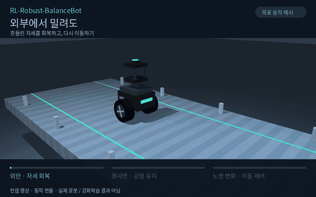

# RL-Robust-BalanceBot

이 로봇을 시뮬레이션에 spawn해서, 강화학습으로 강건성이 요구되는 환경에서도 **밸런스를 유지하면서 제어되는 시뮬레이션**을 구축하는 것이 목표입니다.

외부에서 밀리거나, 경사면과 고르지 않은 바닥을 지나더라도 넘어지지 않고 균형을 잡으면서 원하는 방향으로 움직이게 하려고 합니다.

## 만들고 싶은 동작

[](docs/media/balancebot-concept.mp4)

[MP4 영상 보기](docs/media/balancebot-concept.mp4)

위 영상은 프로젝트 방향을 보여주는 **컨셉 영상**입니다. 사진을 참고해 만든 간단한 로봇 형상에 목표 동작을 연출했으며, 실제 로봇 모델을 spawn한 영상이나 강화학습으로 얻은 제어 결과는 아닙니다.

현재는 프로젝트 목표와 동작 예시를 담아둔 상태입니다. 실제 로봇 모델과 강화학습 환경은 앞으로 추가합니다.

<details>
<summary>컨셉 영상 다시 만들기</summary>

```bash
python3 -m pip install -r scripts/requirements-video.txt
MUJOCO_GL=egl python3 scripts/render_concept.py
```

영상 제작용 코드이며, 학습이나 물리 기반 제어 검증을 수행하지 않습니다.

</details>
