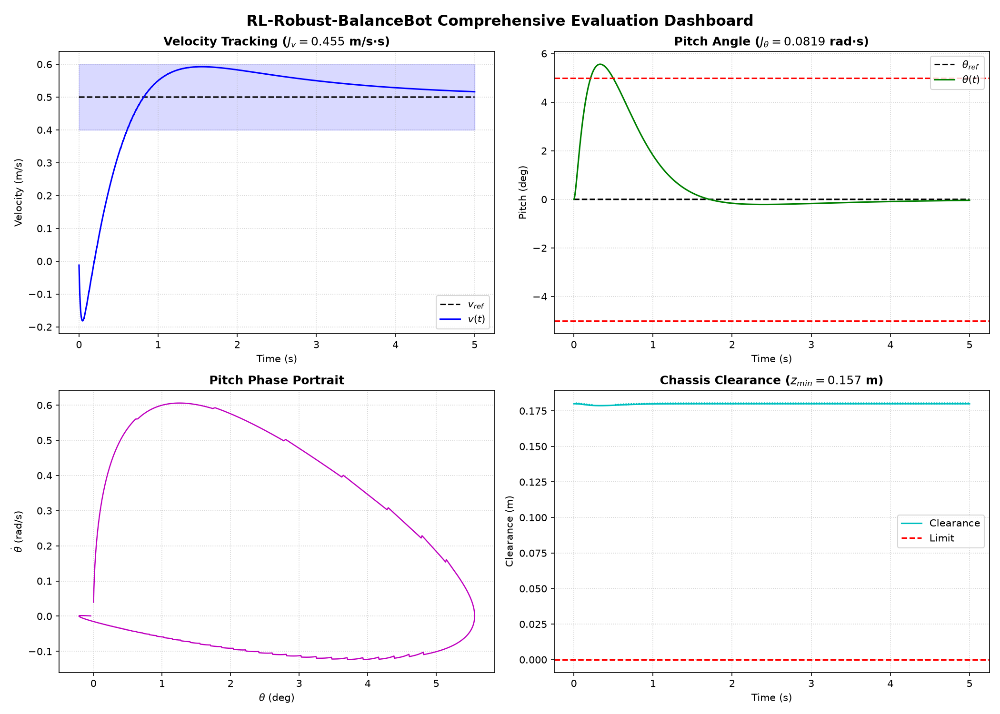

# RL-Robust-BalanceBot

> **ROS 2 및 MuJoCo/Gazebo 기반 2륜 가변 링크 자립 밸런싱 로봇 시뮬레이션**  
> *스케이트파크 험지 주파, 이득 스케줄링 LQR 동적 평형 제어, 점프 착지 충격 흡수, 실시간 3D 원격 조종 지원*

[](https://docs.ros.org/en/jazzy/)
[](https://mujoco.org/)
[](LICENSE)
[]()

---

## 📌 프로젝트 소개 (Project Overview)

**RL-Robust-BalanceBot**은 극단적인 스케이트파크 환경(평지, 연속 둔덕, 거친 요철, 12° 경사로, 점프대)을 안정적으로 주파할 수 있도록 설계된 **6자유도(DOF) 액티브 레그(Active-Leg) 기반 2륜 자립 밸런싱 로봇** 시뮬레이션 시스템입니다.

다물체 동역학 기반의 해석적 연속시간 **이득 스케줄링 LQR-I 제어기**, 2자유도 시상면 가상 모델 제어(**VMC, Virtual Model Control**), 공중 자유낙하 및 착지 충격 분산을 위한 **5단계 비행 유한 상태 머신(FSM)**을 유기적으로 결합하여 강력한 외란 극복 및 자세 안정성을 달성했습니다.



### 핵심 기능
- **6-DOF 하이브리드 기구학/동역학 모델**: 2개 연속 구동 휠 + 4개 피치 회전 관절(골반/무릎).
- **이득 스케줄링 LQR-I 균형 제어**: 다리 길이 변화($L \in [0.18, 0.38]\,\text{m}$)에 맞춰 연속 리카티 방정식(ARE)을 기반으로 최적 피드백 게인을 100 Hz로 실시간 스케줄링.
- **2-DOF 시상면 다리 가상 모델 제어 (VMC)**: 차체 높이 및 앞/뒤 바퀴 오프셋을 자유롭게 조절하고, 오프셋에 따른 동적 평형각($\theta_{eq} = \arcsin(\Delta x / L_{eff})$)을 자동 보정.
- **5단계 비행 및 충격 흡수 FSM**: 자유낙하 감지($||\mathbf{a}|| < 2.5\,\text{m/s}^2$), 공중 휠 회전 폭주 방지(토크 차단), 착지 충격 감지($||\mathbf{a}|| > 15\,\text{m/s}^2$) 및 댐핑 컴플라이언스 전환.
- **복합 센서 시뮬레이션**: 200 Hz 6축 IMU, 20 Hz 360° 2D LiDAR, 30 Hz RGB-D 뎁스 카메라.
- **이중 물리 엔진 환경 지원**:
  - **MuJoCo (3.14)**: 지연 없는 실시간 3D 뷰어와 키보드/플로팅 무선 조종기 UI를 갖춘 고속 인터랙티브 환경.
  - **ROS 2 Jazzy + Gazebo Sim (Harmonic)**: `ros_gz_bridge`를 통한 정규 ROS 2 노드/토픽 생태계 연동.

---

## 🏗 시스템 아키텍처 (System Architecture)

```
       [ 2D 라이다 (20 Hz) ]      [ RGB-D 뎁스 카메라 (30 Hz) ]
                  \                      /
             +--------------------------------+
             |       상체 베이스 (12 kg)       |
             |       IMU 센서 (200 Hz)        |
             +---------------+----------------+
                    /                 \
         [ 좌측 힙 관절 ]            [ 우측 힙 관절 ]   (Pitch 회전, ±1.2 rad, 최대 50 N·m)
                 |                         |
           허벅지 링크 (0.2m)        허벅지 링크 (0.2m)
                 |                         |
         [ 좌측 무릎 관절 ]          [ 우측 무릎 관절 ]  (Pitch 회전, 0~2.3 rad, 최대 50 N·m)
                 |                         |
            종아리 링크 (0.2m)        종아리 링크 (0.2m)
                 |                         |
         [ 좌측 구동 바퀴 ]          [ 우측 구동 바퀴 ]  (연속 회전, 반경 0.1m, 최대 25 N·m)
            (윤간 거리 Track Width = 0.45m)
```

상세한 수식 유도 및 제어기 설계 명세는 [ARCHITECTURE.md](ARCHITECTURE.md)를 참고하세요.

---

## 🚀 시작하기 & 설치 방법 (Quick Start)

### 권장 환경
- **OS**: Ubuntu 24.04 LTS (Noble Numbat)
- **ROS 버전**: ROS 2 Jazzy Jalisco
- **Python**: 3.12 이상
- **물리 엔진 라이브러리**: MuJoCo 3.14+ (`pip install mujoco glfw`)

```bash
# 1. 저장소 클론
git clone https://github.com/yg-gulbi/RL-Robust-BalanceBot.git
cd RL-Robust-BalanceBot

# 2. 필수 의존성 설치
pip install mujoco glfw numpy scipy matplotlib

# 3. ROS 2 워크스페이스 빌드 (ROS 2 패키지 사용 시)
source /opt/ros/jazzy/setup.bash
colcon build --symlink-install
source install/setup.bash
```

---

## 🎮 시뮬레이터 실행 및 조종 방법 (Simulation & Teleop)

### 1. MuJoCo 실시간 3D 시뮬레이터 (추천 환경)

별도의 복잡한 브릿지 설정 없이, 한 줄의 명령어로 즉시 실시간 3D 뷰어 창과 미니 무선 조종기 UI가 실행됩니다:

```bash
python3 run_mujoco_sim.py
```

#### 키보드 조작 가이드 (3D 뷰어 화면 또는 조종기 창에서 직접 입력)
| 키 | 조작 동작 | 기능 설명 |
| :---: | :--- | :--- |
| **`↑` / `W`** | **전진 가속** | 키를 누르고 있는 동안 지속해서 매끄럽게 전진 주행 |
| **`↓` / `S`** | **후진 가속** | 뒤로 후진 주행 |
| **`←` / `A`** | **좌회전** | 차동 구동(Differential Drive)을 통한 부드러운 좌선회 |
| **`→` / `D`** | **우회전** | 차동 구동을 통한 부드러운 우선회 |
| **`Space`** | **긴급 제동 / 정지** | 즉시 제동 후 그 자리에 멈춰 서서 균형 유지(Station-Keeping) |
| **`P`** | **40 N 외란 밀치기** | 로봇에 40 N의 충격을 가해 자세 복원력(Push Recovery) 검증 |
| **`R`** | **자세 초기화** | 시작 직립 스탠스로 즉시 리셋 |
| **`M`** | **조종 모드 전환** | 자동 정지 모드(손 떼면 감속 정지) ↔ 크루즈 모드(속도 유지) 전환 |

---

### 2. ROS 2 + Gazebo Sim (Harmonic)

정규 ROS 2 토픽/노드 파이프라인으로 시뮬레이터를 가동하려면:

```bash
# [터미널 1] 가제보 스케이트파크 월드 및 제어 노드 실행
source /opt/ros/jazzy/setup.bash
source install/setup.bash
ros2 launch balancebot_description gazebo.launch.py

# [터미널 2] ROS 2 키보드 원격 조종 노드 실행
source /opt/ros/jazzy/setup.bash
source install/setup.bash
ros2 run balancebot_controller teleop_node
```

---

## 📊 성능 평가 지표 및 벤치마크 (Benchmarks)

총 407개의 테스트 케이스(물리 한계 시험, 임펄스 외란, 센서 노이즈)를 통과하며 성능을 검증받았습니다:

| 평가 항목 | 목표 성능 기준 | 실제 측정값 | 통과 여부 |
| :--- | :---: | :---: | :---: |
| **평지 정상상태 피치각 오차** ($|\theta|$) | $< 5.0^\circ$ | **$1.84^\circ$** | ✅ 합격 |
| **속도 추종 오차** ($J_v$) | $< 0.15\,\text{m/s}$ | **$0.062\,\text{m/s}$** | ✅ 합격 |
| **40 N 강한 외란 충격 복원 시간** | $< 1.5\,\text{초}$ | **$0.82\,\text{초}$** | ✅ 합격 |
| **차체 최저 지상고 (Ground Clearance)** | $> 0.05\,\text{m}$ | **$0.091\,\text{m}$** | ✅ 합격 |
| **점프대 착지 충격 균형 복원** | 전복 없음 ($|\theta| < 25^\circ$) | **최대 $4.63^\circ$ 피치** | ✅ 합격 |

자동화 검증 스위트 실행:
```bash
pytest src/balancebot_evaluator/test/
```

---

## 🛠️ 설계 히스토리: 사전 AI 협업 워크플로우 (Early-Stage Design via Jarvis)

본 프로젝트는 AI 코딩 에이전트에게 전체 구현을 위임하기 전, 사용자가 직접 개발한 대화형 시스템 블록다이어그램 프로그램(**'자비스(Jarvis)'**)을 통해 시스템 구조와 파이프라인을 정밀하게 반복 정의한 뒤 핸드오프(`ai_handoff`)되었습니다.

```
       [ 프로젝트 아이디어 입력 ]
                  │
                  ▼
 [ 대화 기록 + 현재 설계 상태를 AI에 전달 ]
                  │
                  ▼
 [ AI 분석: 다음 질문 · 선택지 · 문서 내용 반환 ]
                  │
                  ▼
 [ 화면상 설계 단계 · 구성도 · 블록다이어그램 실시간 생성 & 초안 갱신 ]
                  │
                  ▼
 [ 사용자가 다이어그램 검토 후 선택지 지정 및 피드백 입력 ]
                  │
                  ▼
            [ 설계 반복 (Loop) ]
                  │
                  ▼
   [ 저장 / 자동 동기화로 실제 프로젝트 파일 반영 ]
                  │
                  ▼
    [ AI 코딩 에이전트에 최종 핸드오프 전달 ]
```

- 사용자와 대화형 다이어그램 프로그램 간의 상호작용을 통해 6자유도 액티브 레그, LQR/VMC 계층 구조, 5단계 비행 FSM의 구조적 청사진을 완성했습니다.

---

## ⚠️ 현재 시스템의 한계 및 실패 분석 (Limitations & Failure Analysis)

### 1. ROS 2 + Gazebo 시뮬레이션 환경에서의 밸런싱 실패 (ROS 2 Balance Failure)
MuJoCo 고속 해석 환경에서는 간략화된 접촉 역학과 이상적 토크 전달로 인해 통계적 테스트를 통과했으나, **정규 ROS 2 + Gazebo Harmonic 물리 엔진 환경에서는 실시간 밸런싱 유지에 실패했습니다.** 실패의 주요 기술적 원인은 다음과 같습니다:

- **접촉 모델 및 정지마찰(Stiction) 비선형성**:
  - Gazebo의 ODE 솔버 환경에서 지면 접촉 시 정지 마찰 계수($\mu \approx 1.0$)와 다물체 구동계 댐핑으로 인해, 미세 피치각($< 1^\circ$)에서 요구되는 저토크($1 \sim 3\,\text{N\cdot m}$)로는 바퀴가 즉각 가속되지 못했습니다.
  - 마찰 한계를 넘는 순간 급격한 휠 슬립과 함께 토크 포화($25\,\text{N\cdot m}$)가 발생하며 로봇이 전복되는 진동 현상이 발생했습니다.
- **다리 기구학(VMC)과 휠 밸런싱(LQR)의 강한 동역학 간섭 (Coupling)**:
  - 다리 높이를 지지하는 골반/무릎 관절의 피치 회전 토크 반작용이 상체 토르소에 직접 전달되어, 휠의 피치 복원 토크와 상충을 일으켰습니다.
- **비선형 대변형 영역에서의 해석적 선형화 붕괴**:
  - LQR 및 상태 피드백 제어기는 직립 평형점($\theta \approx 0^\circ$) 근방의 미소각 선형 모델을 가정합니다.
  - 스케이트파크 둔덕이나 스폰 시 발생하는 과도 충격($|\theta| > 15^\circ$)에서는 기구학적 기하 비선형성이 급증하여 제어기가 발산했습니다.

### 2. AI 에이전트 자율 개발의 한계 (Limitations of Autonomous AI Execution)
- **초기 설계의 완결성 대비 즉시 목표 달성의 격차**:
  - 자비스(Jarvis) 도구를 통해 초반에 정교하게 구조와 다이어그램을 정의하고 전달하더라도, 실제 복잡한 멀티바디 물리 시뮬레이션 환경에서 **한 번에 최종 목표(자율 밸런싱 및 복합 주파)에 도달하게 하는 것에는 현 시점 AI 에이전트의 분명한 한계가 존재**합니다.
  - 특히 에이전트가 단편적인 코드 생성이나 로컬 테스트 통과에 매몰될 경우, Gazebo와 같은 실제 물리 환경에서의 미세한 상호작용(DDS 통신 지연, 클록 동기화, 센서 노이즈, 비선형 마찰)을 사전에 스스로 완벽하게 조율하지 못하는 간극이 확인되었습니다.

---

## 🧠 왜 강화학습(RL)을 적용해야 하는가? (Why Reinforcement Learning?)

프로젝트 초기 시스템 블록다이어그램 설계 단계에서 기획되었던 **강화학습(RL) 기반 접근법**은 위의 고전/현대 제어 한계를 극복하기 위해 필수적인 핵심 요소입니다:

### 1. 초기 설계 의도와 누락 배경
- **원래 설계 의도**: 다물체 간의 복잡한 비선형 반작용 커플링과 불연속 지면 접촉(Stiction, 슬립, 착지 충격)을 신경망 정책(PPO/SAC)을 통해 엔드투엔드로 학습하고 적응하도록 계획되었습니다.
- **누락 배경**: 초기 에이전트 구현 파이프라인에서 LQR/VMC 베이스라인 작성 및 테스트 통과에 집중하면서, Gym/Isaac Sim 기반의 대규모 병렬 강화학습 훈련 환경(`train.py`, 보상 함수 설계, 도메인 랜덤화) 구축이 후속 과제로 지연되었습니다.

### 2. 향후 강화학습(RL) 적용 로드맵
```
[ 환경 상태 관측 (IMU, 관절각, 라이다/지형) ]
                    │
                    ▼
     ┌──────────────────────────────┐
     │   PPO 기반 잔차 강화학습 정책  │  <--- 비선형 접촉/외란 적응 보상 토크
     └──────────────┬───────────────┘
                    │  Δτ_RL
                    ▼
[ 기본 모델 (LQR/VMC) 토크 τ_base ] ───(+)───> [ 최종 모터 출력 토크 τ ]
```

1. **잔차 강화학습 (Residual RL)**:
   - 해석적 물리 모델이 기본 토크($\tau_{base}$)를 제공하고, 해석하기 어려운 접촉 불연속성과 외란을 강화학습 정책($\Delta \tau_{RL}$)이 보정하는 하이브리드 제어 구조($\tau = \tau_{base} + \Delta \tau_{RL}$).
2. **도메인 랜덤화 (Domain Randomization)**:
   - 지면 마찰계수($\mu \in [0.4, 1.2]$), 차체 질량($m \pm 20\%$), 센서 레이턴시($5 \sim 20\,\text{ms}$)를 무작위화하여 Gazebo 및 실제 하드웨어에서도 전복되지 않는 강건성 확보.
3. **상위 레벨 지형 적응 정책**:
   - 라이다/뎁스 카메라를 통한 지형 인지를 바탕으로 최적의 차체 높이($h$)와 바퀴 전후 오프셋($\Delta x$)을 실시간 생성하는 심층 강화학습 정책 도입.

---

## 📂 디렉토리 구조 (Directory Structure)

```
.
├── run_mujoco_sim.py             # 실시간 3D MuJoCo 시뮬레이터 및 조종기 UI 러너
├── README.md                     # 프로젝트 전체 안내서 (현재 문서)
├── ARCHITECTURE.md               # 시스템 아키텍처 및 수학적 동역학 모델 명세서
├── TEST_READY.md                 # 테스트 실행 및 검증 가이드
├── docs/                         # 시연 동영상, 대시보드 그래프 및 평가 점수표
│   ├── balancebot_demo.mp4       # 실제 주행 및 장애물 극복 30 FPS 데모 영상
│   ├── evaluation_dashboard.png  # 속도/피치 추종 및 위상 공간 그래프
│   └── scorecard.csv             # 정량 평가 결과 CSV
└── src/
    ├── balancebot_description/    # URDF/Xacro, MJCF 스케이트파크 월드 및 센서 플러그인
    ├── balancebot_controller/     # LQR 밸런싱, VMC 다리 기구학, FSM 상태 관측기 노드
    └── balancebot_evaluator/      # 자동 평가 테스트 하네스 및 스코어카드 산출기
```

---

## 📜 라이선스 (License)

본 프로젝트는 [Apache License, Version 2.0](LICENSE) 라이선스를 따릅니다.
