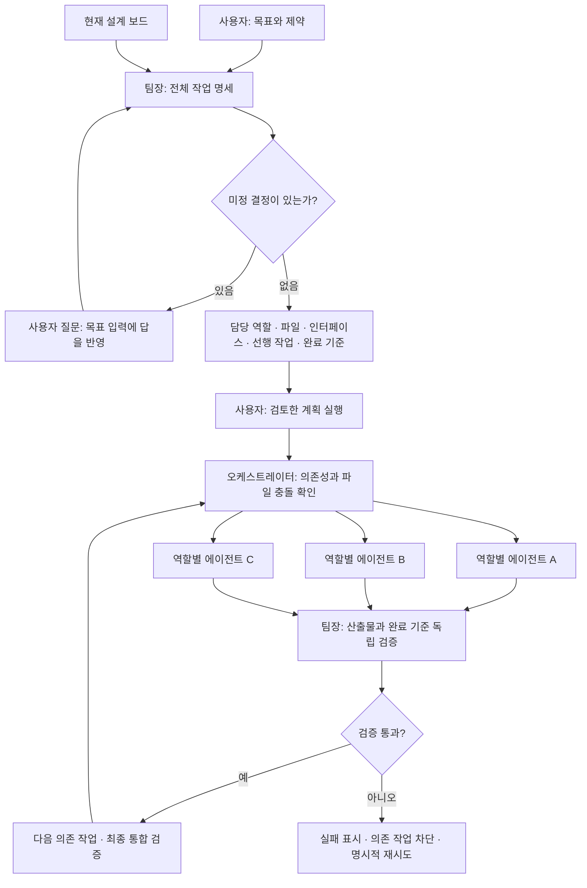

# Javis 오케스트라

사용자가 최종 목표와 제약을 제시하면 팀장이 현재 설계를 바탕으로 끝까지의 작업 명세를 만든다. 사용자가 명세를 검토하고 실행을 누르면 역할별 Codex 에이전트가 실제 파일을 작성하고 검증한다. Javis는 의존성, 파일 배정, 진행 상태와 검증 기록을 관리한다.

## 실행 방법

1. Javis 패널에서 **오케스트라** 탭을 연다.
2. 끝까지 달성할 목표와 사용할 기술·제약을 적고 **팀장에게 작업 계획 요청**을 누른다.
3. 작업 카드를 펼쳐 역할, 담당 경로, 작업 지시·인터페이스, 선행 작업, 완료 기준을 확인한다.
4. 미정 질문이 있으면 목표 입력에 답을 반영하고 계획을 다시 요청한다. 미정 질문이 남아 있는 계획은 실행되지 않는다.
5. **검토한 계획 실행**을 누른다. 결과와 팀장 검토는 각 카드에서 확인한다.
6. 실패한 선행 작업의 원인을 해결하고 해당 카드의 재시도를 누른 후 실행한다. 차단된 후속 작업도 별도로 재시도한다.

## 동작과 경계

- Codex App Server를 역할별 별도 프로세스·대화로 실행한다. 기존 Codex 로그인을 사용하고 모델 설정은 로컬 기본값을 따른다.
- 계획 작성과 결과 검토는 읽기 전용이다. 구현 에이전트는 프로젝트 작업공간에 쓰기 권한을 가진다. 일반 설계 대화는 읽기 전용을 유지한다.
- 최대 3개 작업이 동시에 실행된다. 담당 경로가 같거나 상위·하위 관계인 작업은 직렬 실행한다. 선행 작업은 팀장 검증까지 통과해야 완료로 인정된다.
- 담당 경로는 작업 지시 및 스케줄러의 충돌 방지 기준이다. 운영체제 샌드박스의 쓰기 범위는 프로젝트 전체이며 파일별 강제 격리는 아니다. 보고된 산출물의 담당 범위와 실제 존재 여부를 검사한다.
- 작업을 완료했다고 보고하는 것과 검증 통과를 구분한다. 검증 근거가 부족하면 실패로 남기며 다음 의존 작업을 막는다. 최종 통합 검증도 명세에 포함하도록 팀장에게 지시한다.
- 계획 이후 설계 보드가 바뀌면 이전 계획을 실행하지 않는다. 새 명세가 필요하다. 실행 중에는 설계 입력과 프로젝트 전환을 막는다.
- 작업당 제한 시간은 30분이다. 중단은 전용 에이전트 프로세스를 종료한다. 이미 작성된 파일은 보존하므로 중단·실패 후 부분 변경을 확인해야 한다. 자동 롤백이나 자동 무한 재시도는 하지 않는다.
- `.design-studio/orchestra.json`에 목표, 미정 질문, 명세, 상태, 결과와 검토 및 역할별 대화 ID를 저장한다. 에이전트가 기록 파일을 수정하지 않도록 지시한다. 동시 실행은 PID 잠금 파일로 막는다. 재시작 시 진행 중 상태는 중단으로 표시하며 자동으로 다시 실행하지 않는다.
- 계획을 새로 생성하면 기존 작업 보드를 대체한다. 이미 구현된 파일은 삭제하지 않는다.
- 전체 프로젝트가 완성된 것이 아니라 오케스트레이터 기능을 구현한 것이다. 실제 로봇의 균형·주행·착지 성능은 별도 구현과 시뮬레이션 검증이 필요하다.

통신 인터페이스 참고: [공식 Codex App Server 문서](https://developers.openai.com/codex/app-server). 설치된 실행 파일의 JSON 스키마로 샌드박스와 승인 정책 형식도 확인했다.
