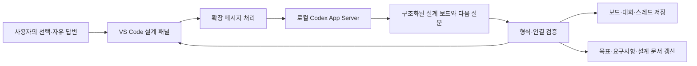

# 설계 도구의 연결 구조

사용자가 선택한 전용 VS Code 패널 방식을 구현한다.

연결은 stdio JSON-RPC이며 별도 웹 서버 포트가 필요 없다. 기존 Codex 로그인을 사용하고 기본 모델 설정을 따른다. 첫 질문은 초기 맥락에서 제공하며 답변 이후에는 같은 thread를 이어간다. 읽기 전용 Codex 응답을 확장이 검증하고 지정된 프로젝트 문서로 내보낸다.

보드 종류는 목표 연결도·시스템 구조도·동작 흐름도다. 각 블록은 확정·제안·미정 상태와 설명을 가지며 블록 선택을 다음 대화의 관심 영역으로 전달한다.

이 도구의 전용 대화는 원래 작업 채팅과 별도이며, 기존 합의사항을 초기 데이터로 전달한다. 로봇 시뮬레이터, 제어기와 센서 구성은 이후 설계 대화에서 정한다.
